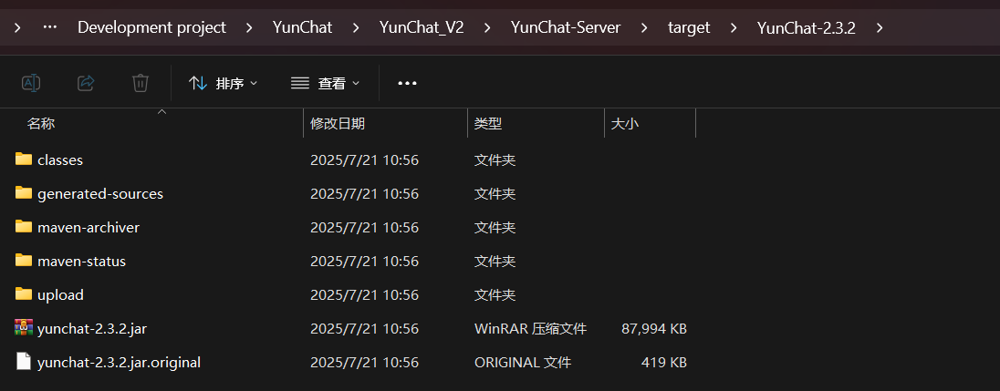

# 运行项目

::: details 点此查看后端运行方法
先把 `HandSock-Server` 打包成Jar包然后再以ROOT权限运行，或直接使用IDEA直接编译运行
:::

后端的打包路径 `target/Handsock2.0.1`，这里面的东西不要去动它，如果要上传至服务器运行，请将 `Handsock2.0.1` 文件夹打包成压缩包，通过运行压缩包里面的 `.jar` 文件来启动后端。



注意：后端请使用管理员权限运行，否则将造成文件无法正常读写和上传。

::: details 点此查看前端运行方法
客户端运行通过 `npm run build` 命令打包的dist目录，预览dist目录请使用 `npm run preview`命令，如想使用开发模式运行，请使用 `npm run dev` 运行前端
:::

首次运行需要修改管理员账号和密码，以防止管理员账号被别人登录：

``` text
账号：handsock
密码：handsock123
```